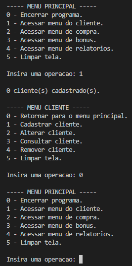
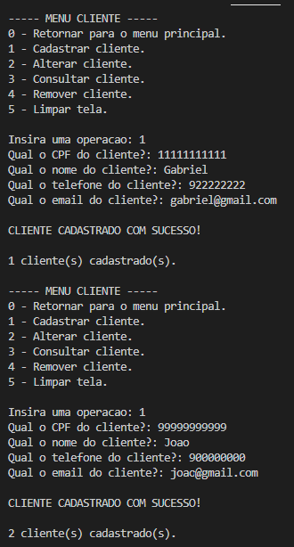
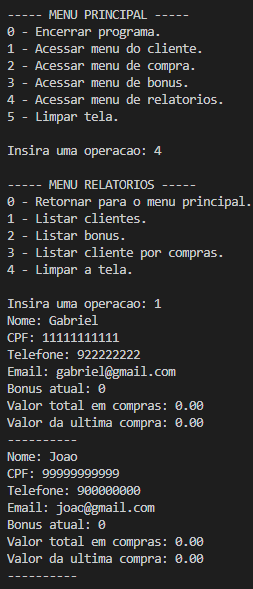
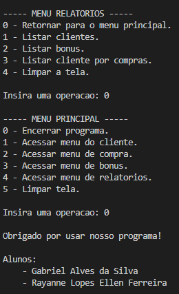

# LojaC

Projeto antigo entregue como trabalho final da disciplina "Programação Estruturada". Ele gerencia os clientes e as compras de uma loja fictícia. Foi feito em conjunto com [Rayanne Ellen Lopes Ferreira](https://github.com/RayanneLps). Resultou em mais de 1000 linhas de código.

Cada menu segue a mesma estrutura lógica com 3 funções básicas: uma função exibe as operações do menu, outra requisita uma operação para o usuário e a última processa a operação escolhida(invocando a função desejada). Essas 3 funções ficam alojadas em um loop para que o usuário retorne ao menu após fazer o que deseja. 

Os dados dos clientes foram organizados em structs e armazenados em arrays.

Pra eliminar o uso de variáveis globais, o programa usa ponteiros em praticamente todo lugar, a fim de "movimentar as variáveis através dos menus e operações".

## Screenshots

Entrando e saindo de um menu.

Cadastrando clientes.

Listando clientes cadastrados.

Encerrando o programa.

